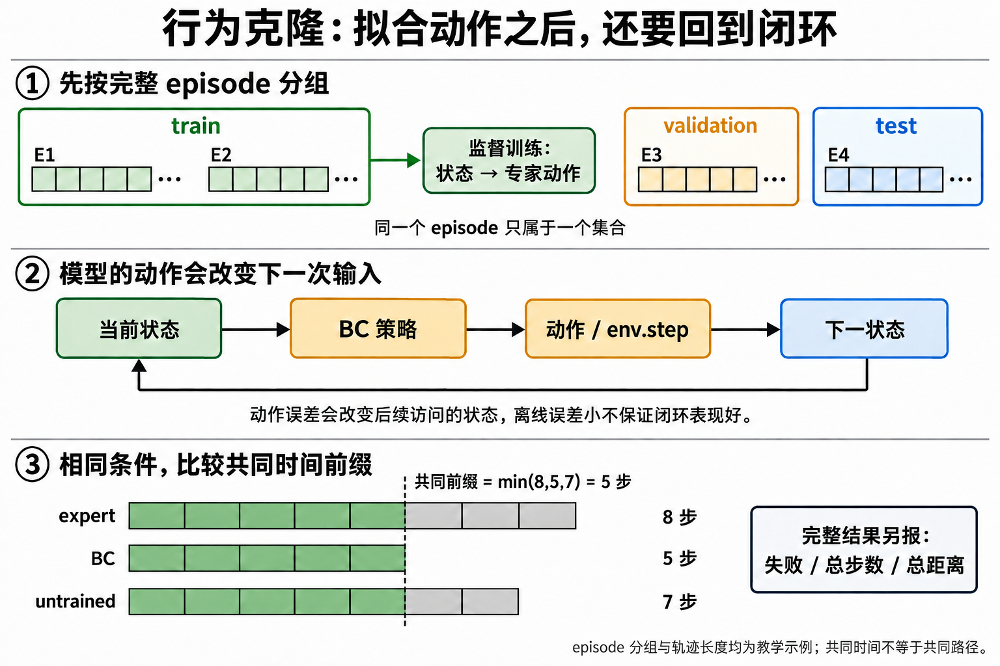

# 第三单元：从几何示范到行为克隆

本单元把第一单元的几何控制器当作可检查的专家，收集 MetaDrive 真值状态与专家动作，训练一个很小的 PyTorch MLP，再把 checkpoint 重载后放回同一个 `env.step` 闭环。学习者已经做过基础深度学习训练，因此重点放在数据边界、episode 切分、状态分布变化和闭环证据；这里不引入 RL。

<figure class="course-figure">
  
  <a href="../../assets/visuals/imitation-learning.png">查看原图</a>
  <figcaption><strong>AI 原理图 · 手算/机制示意</strong> · 专家的完整 episode 先划分集合，再训练和闭环评测</figcaption>
</figure>

因果链是“专家完整 episode → 按 episode 划分 train/validation/test → 当前状态到动作的监督训练 → 重载策略 → `env.step` 闭环”。这样可以把离线拟合和车辆实际访问的新状态分开检查。

**手算检查**：三条测试 episode 长度为 8、5、7，共同时间窗口长度是 5，即最短 episode；完整轨迹和各自失败信息仍单独保留。

## 运行

在仓库根目录执行：

```powershell
.venv\Scripts\python.exe -m pip install -r requirements-driving.txt
.venv\Scripts\python.exe -m pip install -r requirements-learning.txt
.venv\Scripts\python.exe scripts\build_imitation.py
.venv\Scripts\python.exe scripts\run_imitation.py --output artifacts\imitation
.venv\Scripts\python.exe -m jupyter lab course\imitation\05_demonstrations_and_bc.ipynb
```

首次运行需要包含 MetaDrive 和 CPU PyTorch 的环境。CLI 默认每集 60 个决策步，数据规模很小，训练使用 CPU、`DataLoader(num_workers=0)`；输出中的 `collection_time_s` 与 `training_time_s` 分开记录。Notebook 的 cell 可以逐个修改和运行，不要求把一次完整实验隐藏在一个黑盒函数里。

## 数据和评测边界

四个输入特征为 `e_y_m`、`heading_error_rad`、`speed_mps`、`reference_bearing_rad`；动作是转向和油门。输入不含 action、reward、terminal flag、执行后状态或未来状态。均值与标准差只从 train episode 计算，validation 用于选择 checkpoint，held-out test 只在最后评估。

默认 train 初始偏移为 `±0.1m、±0.2m`，validation 为独立 episode 的 `±0.25m`，test 为 `±0.4m`，并使用不重叠的 seed。每个 split 按完整 episode 划分，不按 timestep 随机切分；dataset manifest 会保存 episode id、完整配置、数据 hash 和专家指标。地图固定为第一单元的单车道 block sequence；更换 seed 不是道路泛化。

`run_imitation.py` 在相同 test 条件下保存 geometric expert、untrained MLP 和 BC 的 JSON/CSV/PNG 轨迹，失败时保存 GIF。`metrics.json` 同时报告 offline action MSE、训练曲线、闭环 failure/outcome、共同窗口可重算的轨迹数据以及数据收集和训练时间。短时未失败不等同于到达整条路线；若模型比专家差，保留失败和原因，不制造“算法总是有效”的结论。

## 两课

1. [05 · 示范不是标签表：行为克隆怎样进入驾驶闭环？](05_demonstrations_and_bc.ipynb)：特征契约、真实 MetaDrive episode 收集、episode split、train-only normalization、监督梯度、checkpoint reload 和数据 provenance。
2. [06 · 离线分数和闭环轨迹为什么会不一致？](06_offline_vs_closed_loop.ipynb)：重载模型实际控制车辆、自己的状态访问、covariate shift、共同时间窗口、失败原因和可编辑实验。

选读 [DAgger](https://arxiv.org/abs/1011.0686) Introduction，限制在约 45 分钟。它帮助解释 learner-induced state distribution shift；本单元没有把 DAgger 或道路泛化写成已完成能力。

接下来进入 [第四单元：RL基础](../rl_foundations/README.md)，学习如何从交互奖励更新策略，并与这里的监督动作拟合对照。
