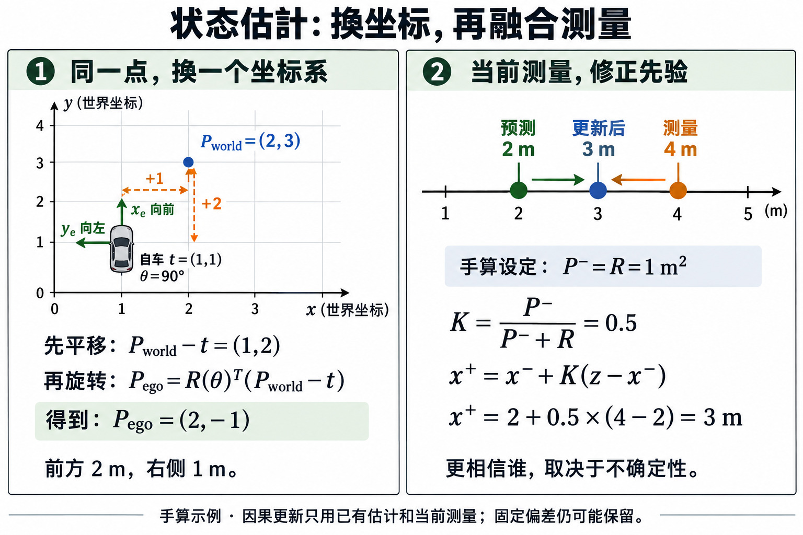

# 第二单元：坐标、测量与状态估计

本单元把第一单元的真值驾驶闭环推进到一个明确的感知边界。学习者先用 SE(2) 逆变换核对 world/ego 坐标，再用固定 seed 生成带 bias 与 Gaussian noise 的 world pose/heading/speed 测量，使用已知固定车道投影 `s/e_y`，最后把一个因果的一维 random-walk Kalman filter 接进控制器。

<figure class="course-figure">
  
  <a href="../../assets/visuals/state-estimation.png">查看原图</a>
  <figcaption><strong>AI 原理图 · 手算/机制示意</strong> · 坐标帧、合成测量与因果滤波如何连接</figcaption>
</figure>

坐标：世界点 → 减去自车位置 → 逆旋转 → ego 坐标。估计：仿真真值 → 合成带噪测量 → 因果滤波 → 控制器。本单元先用可检查的坐标和测量模型，再把滤波状态接回实际闭环。

**手算检查**：车辆原点为 `(1,1)`、朝向 90°，世界点为 `(2,3)`。它在 ego frame 中的坐标是 `(2,-1)`：相对位移 `(1,2)` 经过朝向的逆旋转得到该结果。再设一维滤波预测值 `x⁻=2m`、测量 `z=4m`、`P⁻=R=1m²`，则 `K=.5`、后验 `x⁺=3m`；这些是教学设定。

## 顺序与运行

1. [03 · 坐标帧与测量](03_frames_measurements.ipynb)：手算 world↔ego，检查单位、偏差、噪声和逆变换。
2. [04 · 闭环状态估计](04_state_estimation_closed_loop.ipynb)：同一 noise seed 对照 oracle、raw measurement、filter，比较 input RMSE 与真实驾驶指标。

先生成 notebook：

```powershell
.venv\Scripts\python.exe scripts\build_state_estimation.py
```

再运行真实闭环和导出：

```powershell
.venv\Scripts\python.exe scripts\run_state_estimation.py --output artifacts\state_estimation
```

输出包含每组 JSON、CSV、轨迹 PNG、比较图和 `summary.json`。JSON manifest 显式写出 observer method、measurement config、seed、带单位的测量标准差与每秒过程方差 Q、decision dt 和初始真值；测量方差由 `R=标准差²` 得到。CSV 的 `before_*` 是评估用 truth，`measurement_*` 是当前原始测量，`input_*` 是控制器实际消费的估计状态。

## 读结果的规则

RMSE 下降只说明估计轨迹更接近本次 truth。它可能因为滞后让闭环横向误差变大，因此同时报告 `mean_abs_lateral_error_m`、距离、终止原因、动作和完整 trace。跑满 horizon 不代表到达终点；固定长直道也不能证明对新道路或真实传感器有效。

观测器的边界是每次 run 一次的 `reset(fixed_lane)` 与 `observe(truth, step, dt) -> DrivingObservation`；它还必须在每次 observe 后把当前原始测量写入 `last_measurement`，供 trace 核查。truth 只在当前采样用于构造 synthetic measurement；filter 没有未来轨迹输入。代码位于 [estimation.py](../../src/ad_tutorial/estimation.py)，闭环 hook 位于 [driving.py](../../src/ad_tutorial/driving.py)。

## 研究入口

- TUMFTM：[Autonomous Driving Software Engineering](https://github.com/TUMFTM/Lecture_ADSE)，其中 mapping/localization 章节包含 Kalman filter 工程练习。
- Simo Särkkä 与 Lennart Svensson：[Bayesian Filtering and Smoothing](https://users.aalto.fi/~ssarkka/pub/bfs_book_2023_online.pdf)，用于理解状态转移、测量模型和协方差。

本单元不声称 synthetic noise 或标量滤波器代表真实车辆定位。下一步可研究异步观测、转弯运动模型、丢帧、标定和真实地图，再决定是否引入更复杂的模型。

接下来进入 [第三单元：行为克隆](../imitation/README.md)，学习从专家示范训练策略。该单元回到真值状态输入，以单独研究拟合与闭环分布变化。
